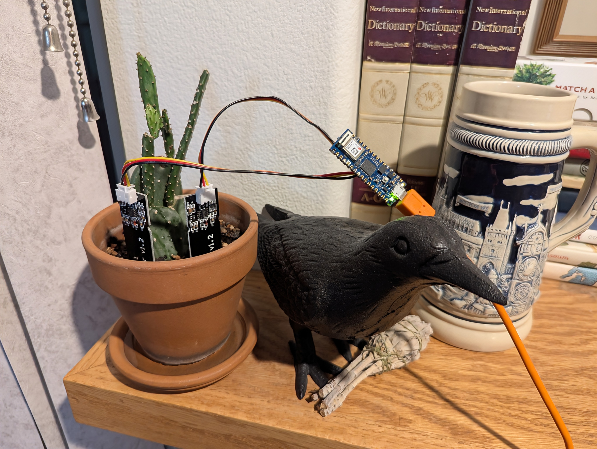

# automatic-soil-monitor

This is a microcontroller project designed to monitor and report the soil moisture level for potted plants, using one or more moisture sensors. It broadcasts the data via BLE at a set interval using the [BTHome protocol](https://bthome.io/), which makes it easy to track using a home automation platform like [Home Assistant](https://www.home-assistant.io/).

## Parts and assembly



I used an [Arduino Nano 33 IoT](https://store-usa.arduino.cc/products/arduino-nano-33-iot) and [these capacitive moisture sensors](https://www.amazon.com/gp/product/B07SYBSHGX/), but this project will also work with different (but functionally equivalent) parts:

- You can use [any microcontroller compatible with TinyGo](https://tinygo.org/docs/reference/microcontrollers/), as long as it has a BLE chip supported by [Go Bluetooth](https://github.com/tinygo-org/bluetooth) (see the readme there for details).
- For the moisture sensors, any that provide an analog output should work.
- The project will work with as many moisture sensors as your hardware allows, as long as the output data doesn't exceed the byte limit of the BLE spec.

Each capacitive moisture sensor has three wires: a power wire ("VCC"), a ground wire ("GND"), and a signal wire ("AOUT"). The following connections need to be made:

- Each moisture sensor's "VCC" wire needs to be connected to a power output pin on the microcontroller that matches the sensor's power specifications. (All the moisture sensors can share the same power output pin.)
- Each moisture sensor's "GND" wire needs to be connected to the microcontroller's ground pin. (All the moisture sensors can share the same ground pin.)
- Each moisture sensor's "AOUT" wire needs to be connected to a separate analog input pin on the microcontroller.

## How to run the project

### Prerequisites

In order to build the project and flash it to your microcontroller, you'll need the following:

- [Go v1.22.3+](https://go.dev/)
- [TinyGo v0.34+](https://tinygo.org/): Follow the install guide specific to your operating system [here](https://tinygo.org/getting-started/install/), and be sure to note the instructions specific to the microcontroller you're using. (You should also be able to find setup instructions specific to your microcontroller [here](https://tinygo.org/docs/reference/microcontrollers/).)
    - Depending on your microcontroller's type of BLE chip, you may need to do some additional setup. See the [Go Bluetooth](https://github.com/tinygo-org/bluetooth) readme for details.
- [Make](https://www.gnu.org/software/make/)

### Configuration

Before building, the project requires some configuration values to be set. You'll need to create a `.env` file at the project root, and then set the following environment variables within it:

- `MICROCONTROLLER_TYPE`: The type of microcontroller you're using. See [this page](https://tinygo.org/docs/reference/microcontrollers/machine/) for a list of valid microcontroller types. You should be able to find the right value to use for your microcontroller [here](https://tinygo.org/docs/reference/microcontrollers/). Once you navigate to the page for your microcontroller, do a search for `-target` to find the example command for flashing to the microcontroller. The value you'll need is the one directly following the `-target` flag.
- `BROADCAST_INTERVAL`: The interval at which the project will broadcast updated moisture data via BLE. This must be a duration in the format used by Go's [time.ParseDuration](https://pkg.go.dev/time#ParseDuration) function.
- `SENSOR_PINS`: The analog input pins on the microcontroller that will be used to read the moisture sensor values. This must be a comma-separated list of the pin numbers that your moisture sensors are connected to on your microcontroller. Note that the actual numbers that TinyGo uses are needed, not the pin names. You should be able to find these under your microcontroller's type [here](https://tinygo.org/docs/reference/microcontrollers/machine/).
- `SENSOR_DRY_CALIBRATIONS`: The "dry" calibration values for each moisture sensor. This must be a comma-separated list of integers, in the same order as the pins in `SENSOR_PINS`. See the [Calibration](#calibration) section below for more information.
- `SENSOR_WET_CALIBRATIONS`: The "wet" calibration values for each moisture sensor. This must be a comma-separated list of integers, in the same order as the pins in `SENSOR_PINS`. See the [Calibration](#calibration) section below for more information.

Here is an example of what a `.env` file for this project might look like:

```
MICROCONTROLLER_TYPE=arduino-nano33
BROADCAST_INTERVAL=1h
SENSOR_PINS=2,34
SENSOR_DRY_CALIBRATIONS=56656,56128
SENSOR_WET_CALIBRATIONS=31872,31232
```

### Building and Flashing

To build the project and flash it to your microcontroller, run `make` (or `make flash`) from the project root. This will also start the serial monitor after flashing the program to the microcontroller, which causes the program's logs to be printed to the terminal. (You can press Ctrl+C to exit the serial monitor.)

If you want to build the project without flashing it to your microcontroller, you can run `make build` instead.

### Calibration

In order to interpret the data from the soil moisture sensors in a meaningful way, the program needs to know what values correspond with completely dry soil and completely wet soil for each sensor. These values are used to calculate the moisture percentage for each sensor, given their readings. As mentioned in the [Configuration](#configuration) section above, the "dry" and "wet" calibrations are set in the `.env` file.

In order to determine what values to use for the "dry" and "wet" calibrations, follow these steps:

1. In your `.env` file, temporarily set `SENSOR_DRY_CALIBRATIONS` and `SENSOR_WET_CALIBRATIONS` to any arbitrary values for each sensor, as long as the two values are different. You should also temporarily set `BROADCAST_INTERVAL` to a short duration, such as `5s`. This will cause the program to take readings more frequently, which will help you determine the "dry" and "wet" calibration values more easily.
2. Stick all the sensors into some completely dry soil. (The soil should be the same as or similar to what you'll be using the sensors to monitor.)
3. Run `make` to build the program and flash it to your microcontroller. Leave the serial monitor running after flashing, as you will use the program's log output to obtain the "dry" and "wet" values.
4. Let the program run for several iterations, to allow it to take several readings while the soil is dry. For each iteration, the logs will show the current reading, along with the minimum and maximum readings seen so far.
5. With the program still running and the sensors still in the soil, water the soil until it's completely wet. Again, let the program run for several iterations, allowing it to take several readings while the soil is wet. The logs will continue to track the minimum and maximum readings seen so far.
6. You can now press Ctrl+C to exit the serial monitor. Refer to the last set of logs shown to get the final minimum and maximum readings for each sensor. One of these will be the "dry" value, and the other will be the "wet" value. You can check against the current reading to determine which is which.
7. Now that you have the values, use them to update `SENSOR_DRY_CALIBRATIONS` and `SENSOR_WET_CALIBRATIONS` in your `.env` file. You can also set `BROADCAST_INTERVAL` to a sensible duration for long-term monitoring, such as `1h`.
8. With the values updated, run `make` once again to update the program on your microcontroller.